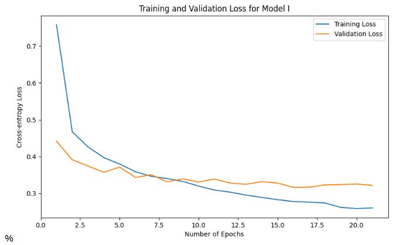

# Custom-Neural-Network-from-Scratch
Custom Neural Network (NN) coded in Python without the use of any external AI/ML libraries. Implmented to solve a  multi-class classification problem using the Fashion MNIST dataset, achieving a test misclassification rate of 11.39%.

The dataset can be downloaded from:
https://www.kaggle.com/datasets/zalando-research/fashionmnist?resource=download.
(or via torch datasets)
- fashion-mnist train.csv: 60,000 training examples.
- fashion-mnist test.csv: 10,000 test examples.

Each example is a 28 × 28 grayscale image, resulting in 784 pixels per image. Each
pixel-value is an integer between 0 and 255, indicating the lightness or darkness of
that pixel. The CSV files have 785 columns: the first column is the class label, and
the remaining 784 columns are the pixel-values.

The NN features the following techniques:
- Adam optimizer with weight decay
- Batch normalization
- Dropout regularization
- Early stopping
- L2 regularization

## Training Results

Note: These results were attained with the current hyperparameter values in the config.py file.
There is still potential for hyperparameter optimization.

## Requirements
- Python 3.8+
- NumPy
- Matplotlib
- PyTorch (for dataset loading)

## Installation
```bash
git clone https://github.com/bartkw12/Custom-Neural-Network-from-Scratch.git
cd Custom-Neural-Network-from-Scratch
pip install -r requirements.txt
```
## Project Structure
```bash
Custom-Neural-Network-from-Scratch/
├── src/
│   └── CustomNN/
│       ├── config.py             # Hyperparameters
│       ├── data_preprocessing.py # Data loading & preprocessing
│       ├── model.py              # Core network architecture
│       └── techniques.py         # Optimization/regularization
├── test.py                       # Training script
├── requirements.txt
└── README.md
```

