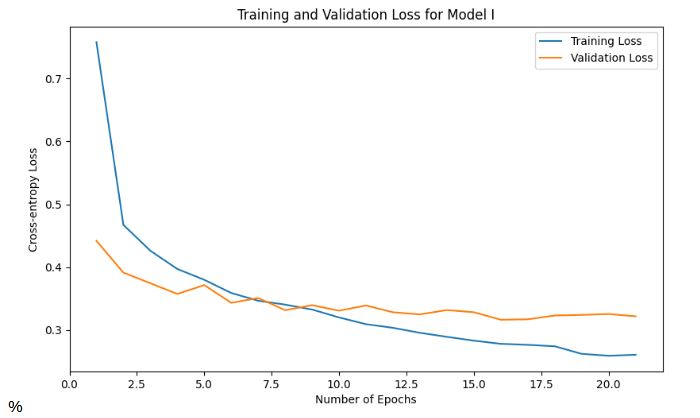

# Custom Neural Network From Scratch

## Abstract
This repository presents a fully connected neural network for the Fashion-MNIST classification dataset, implemented from first principles in NumPy, with PyTorch used only for dataset loading in the custom pipeline. The project is structured as a reusable Python package and includes a parallel PyTorch implementation for architecture and training pipeline comparison.

The current custom model supports mini-batch training with Adam optimization, L2 regularization, batch normalization, dropout, and early stopping. Hyperparameters and layer wiring are centralized through a typed `NetworkConfig` interface.

## Why Build a Neural Network From Scratch?

High-level ML libraries make it easy to train models, but they hide the numerical and architectural details that make neural networks work. This project was built to demonstrate a deeper understanding of:

- how tensors flow through a network during forward propagation
- how gradients are derived and propagated during backpropagation
- how optimizers such as Adam update parameters
- how dropout, batch normalization, and L2 regularization affect training
- how train/validation/test preprocessing should be structured to avoid data leakage
- how a custom implementation can be compared against a framework implementation

## Features


### Custom NumPy Implementation

- Fully connected dense layers
- ReLU activation
- Softmax classification output
- Cross-entropy loss
- Manual backpropagation
- Mini-batch training
- Adam optimizer
- L2 regularization
- Dropout using inverted dropout scaling
- Batch normalization
- Early stopping
- Model evaluation and prediction API
- Save/load support for trained parameters


### PyTorch Reference Implementation

- Equivalent architecture for comparison
- Same Fashion-MNIST preprocessing pipeline
- Same train/validation/test split
- Matching hyperparameters where possible
- Training and validation history logging
- Test accuracy comparison


### Planned / In Progress

- Gradient checking tests
- Confusion matrix visualization
- Per-class accuracy analysis
- Custom-vs-PyTorch loss curve overlays
- CLI-based experiment configuration


## Method Summary
- `custom_nn`: the primary from scratch implementation under `src/custom_nn`
- `NeuralNetwork`: reusable training, evaluation, prediction, save, and load API
- `NetworkConfig`: centralized configuration for architecture and training behavior
- `pytorch_nn`: reference implementation built around the same layer specification and preprocessing flow
- shared Fashion-MNIST preprocessing: shuffle, train/validation split, one-hot encoding, and standardization from training statistics only

## Training Pipeline

The training pipeline follows these steps:

1. Load Fashion-MNIST using `torchvision`.
2. Convert images and labels into NumPy arrays.
3. Shuffle the training set using a fixed random seed.
4. Split the original training set into training and validation subsets.
5. One-hot encode labels.
6. Standardize features using statistics computed from the training set only.
7. Train the custom NumPy network using mini-batch gradient descent with Adam.
8. Track training and validation loss across epochs.
9. Apply early stopping based on validation performance.
10. Evaluate the final model on the held-out test set.

## Model Architecture

The default custom network is a fully connected classifier for flattened Fashion-MNIST images.

```text
Input: 28 × 28 grayscale image
Flatten: 784 features
Dense Layer: [PLACEHOLDER: hidden units]
Batch Normalization
ReLU
Dropout
Dense Layer: [PLACEHOLDER: hidden units]
Batch Normalization
ReLU
Dropout
Output Dense Layer: 10 classes
Softmax + Cross-Entropy Loss.
```

## Training Result


The plot above is retained from the current repository results. Training history from the custom implementation is also written to `results/custom_nn_history.json` for later inspection.


## Mathematical Overview

This implementation manually computes all forward and backward operations.

### Dense Layer

Forward pass:

```math
Z = XW + b
```

Backward pass:
```math
\frac{\partial L}{\partial W} = X^T \frac{\partial L}{\partial Z}
```

```math
\frac{\partial L}{\partial b} = \sum_i \frac{\partial L}{\partial Z_i}
```

```math
\frac{\partial L}{\partial X} = \frac{\partial L}{\partial Z} W^T
```


## Installation
```bash
git clone https://github.com/bartkw12/Custom-Neural-Network-from-Scratch.git
cd Custom-Neural-Network-from-Scratch
pip install -r requirements.txt
pip install -e .
```

## Reproducing a Run
```bash
python train.py
```

Or run the package entry point:

```bash
python -m custom_nn
```

On first run, `torchvision` downloads Fashion-MNIST into `data/`. The training script saves loss history to `results/custom_nn_history.json` and displays a Matplotlib plot at the end of execution.

## Programmatic Usage
```python
from custom_nn import NeuralNetwork, NetworkConfig, load_fashion_MNIST, preprocess_data

config = NetworkConfig()
model = NeuralNetwork(config)

train_dataset, test_dataset = load_fashion_MNIST(seed=config.seed)
(X_train, Y_train), (X_val, Y_val), (X_test, Y_test) = preprocess_data(train_dataset, test_dataset)

history = model.train(X_train, Y_train, X_val, Y_val)
metrics = model.evaluate(X_test, Y_test)
```

## Repository Layout
```text
src/
├── custom_nn/   NumPy-based NN, training pipeline, and configuration
└── pytorch_nn/  PyTorch reference model and comparison utilities
train.py         Thin repository entry point for custom model training
results/         Saved plots and training histories
data/            Fashion-MNIST download cache
```

