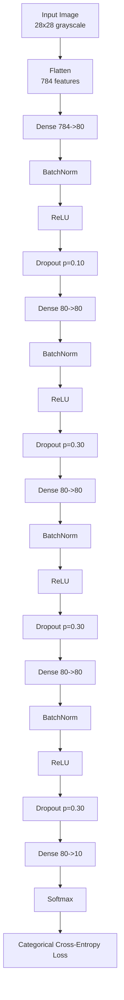
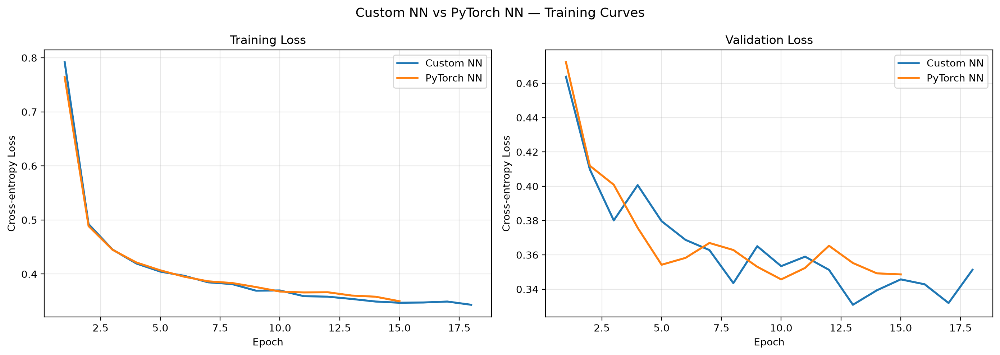
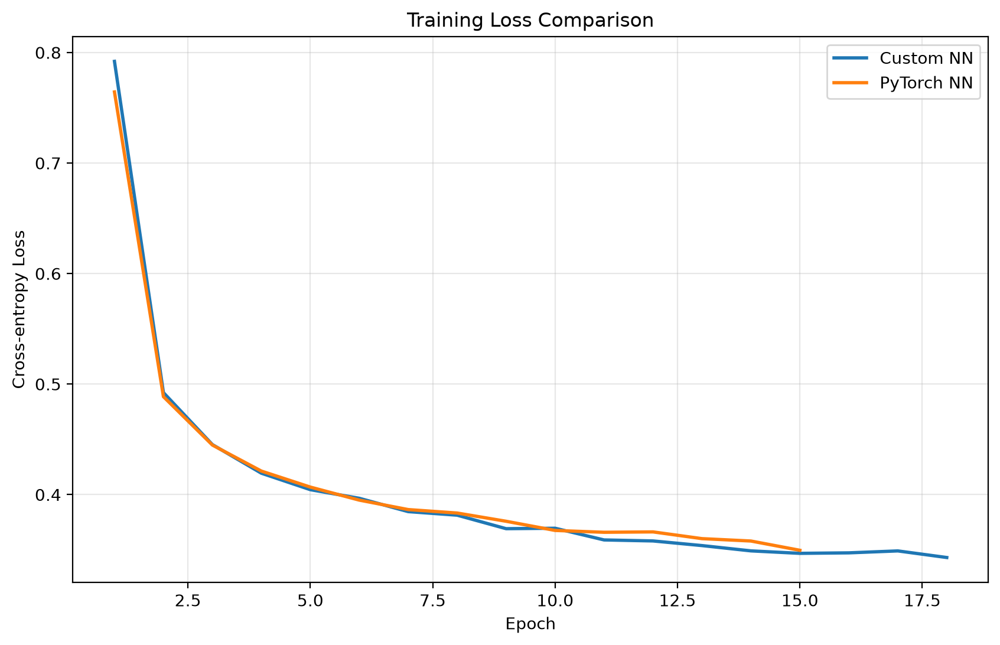
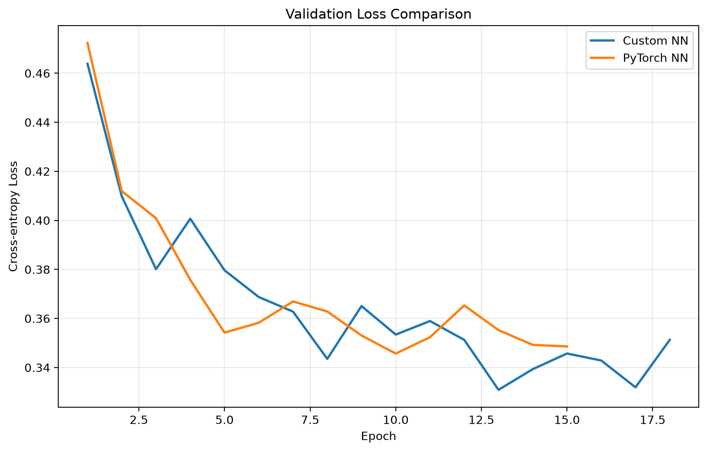
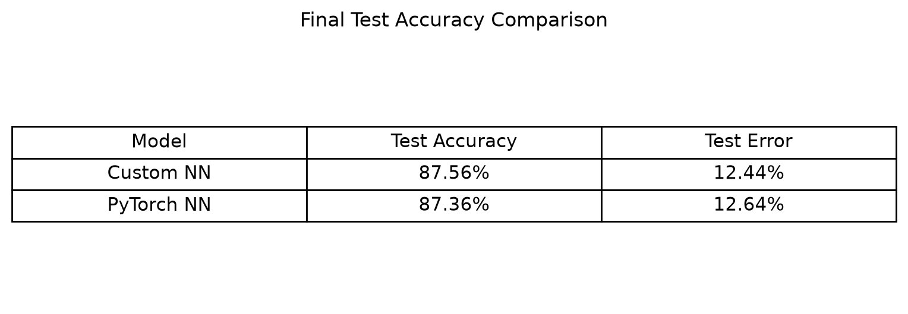
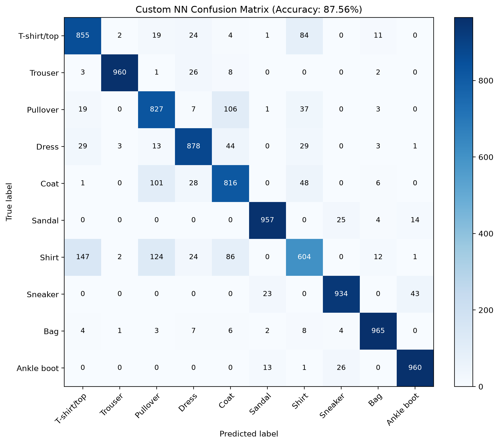
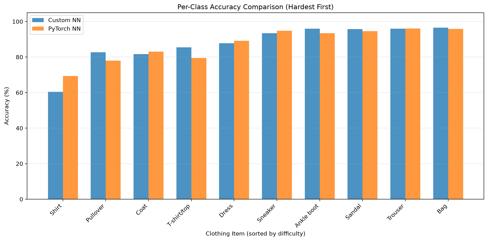
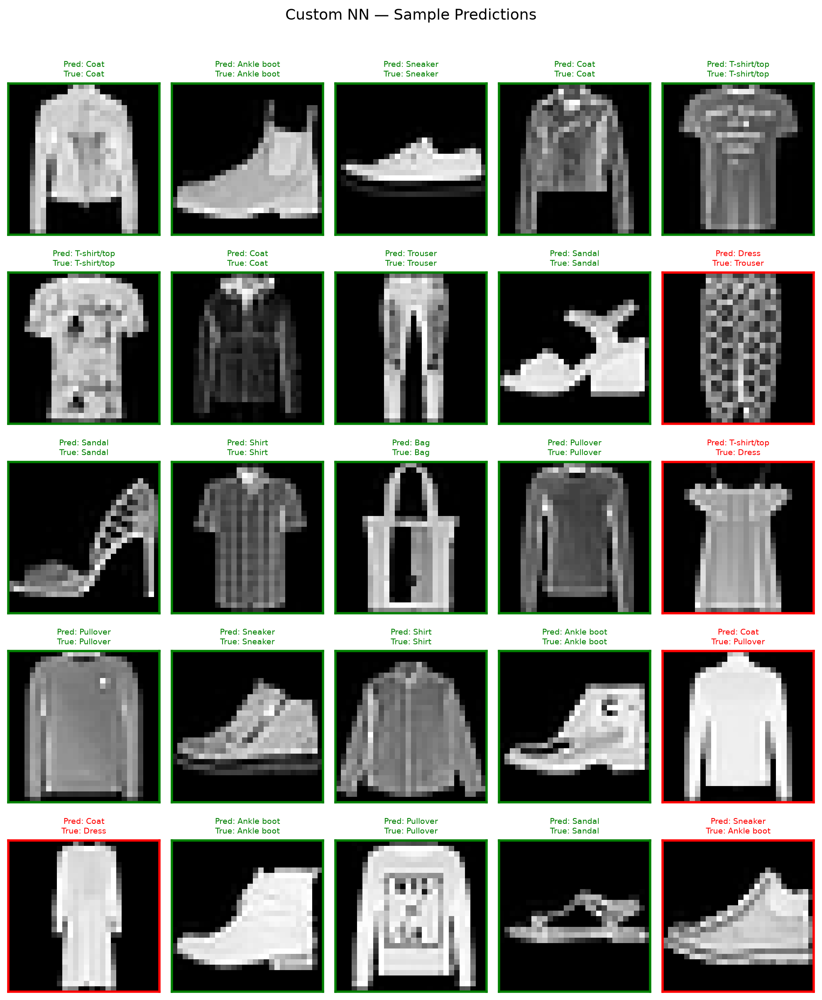
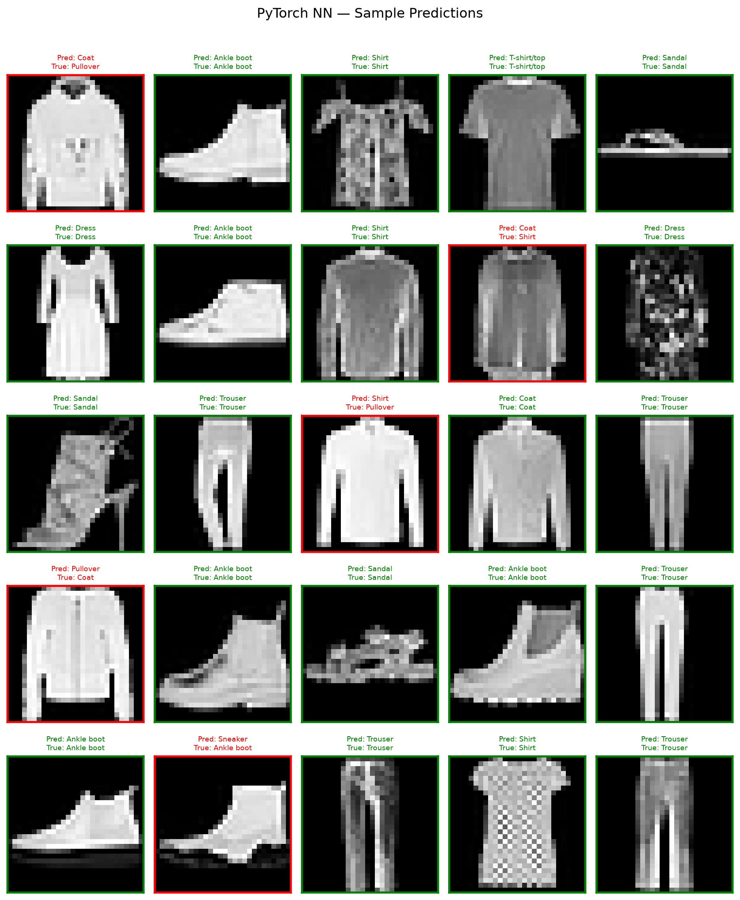

# Custom Neural Network From Scratch

## Overview
This repository implements a fully connected neural network for Fashion-MNIST from first principles using NumPy. The goal is not just to train a classifier, but to expose and validate each part of the training stack: forward propagation, backward propagation, optimization, regularization, and evaluation.

To ground correctness and performance, the project includes a matched PyTorch reference implementation that uses the same architecture shape, data split, seed, and training hyperparameters.

## Why Build It From Scratch
Frameworks hide critical mechanics that matter for debugging and research intuition. This project is designed to make those mechanics explicit:

- Manual gradient flow through Dense, ReLU, Softmax, Dropout, and BatchNorm layers
- Explicit Adam updates including momentum/cache bias correction
- Strict preprocessing hygiene (train-only standardization statistics)
- Side-by-side validation against a framework implementation
- Artifact-driven experimentation with reproducible run summaries

## Architecture Diagram
Default model topology from `NetworkConfig` (`hidden_layers=4`, `hidden_units=80`).


```mermaid
flowchart TD
	A[Input Image\n28x28 grayscale] --> B[Flatten\n784 features]
	B --> C[Dense 784->80]
	C --> D[BatchNorm]
	D --> E[ReLU]
	E --> F[Dropout p=0.10]

	F --> G[Dense 80->80]
	G --> H[BatchNorm]
	H --> I[ReLU]
	I --> J[Dropout p=0.30]

	J --> K[Dense 80->80]
	K --> L[BatchNorm]
	L --> M[ReLU]
	M --> N[Dropout p=0.30]

	N --> O[Dense 80->80]
	O --> P[BatchNorm]
	P --> Q[ReLU]
	Q --> R[Dropout p=0.30]

	R --> S[Dense 80->10]
	S --> T[Softmax]
	T --> U[Categorical Cross-Entropy Loss]
```

## Mathematical Core
Let a mini-batch input be $X \in \mathbb{R}^{m \times d}$ and labels be one-hot vectors.

### Dense Layer
$$
Z = XW + b
$$

$$
\frac{\partial L}{\partial W} = X^T \frac{\partial L}{\partial Z} + \lambda W,
\quad
\frac{\partial L}{\partial b} = \sum_{i=1}^{m} \frac{\partial L}{\partial Z_i},
\quad
\frac{\partial L}{\partial X} = \frac{\partial L}{\partial Z} W^T
$$

### ReLU
$$
\mathrm{ReLU}(x)=\max(0,x),
\quad
\frac{\partial L}{\partial x} = \frac{\partial L}{\partial y}\,\mathbb{1}_{x>0}
$$

### Softmax + Cross-Entropy
$$
\hat{y}_k = \frac{e^{z_k}}{\sum_j e^{z_j}},
\quad
L = -\frac{1}{m}\sum_{i=1}^{m}\sum_{k=1}^{K} y_{ik}\log(\hat{y}_{ik})
$$

With the fused derivative used in this implementation:
$$
\frac{\partial L}{\partial z} = \frac{\hat{y}-y}{m}
$$

### Batch Normalization
For feature-wise batch statistics:
$$
\mu_B = \frac{1}{m}\sum_i x_i,
\quad
\sigma_B^2 = \frac{1}{m}\sum_i (x_i-\mu_B)^2,
\quad
\hat{x}_i = \frac{x_i-\mu_B}{\sqrt{\sigma_B^2+\epsilon}}
$$

$$
y_i = \gamma \hat{x}_i + \beta
$$

### Inverted Dropout
During training (keep probability $p$):
$$
	ilde{x} = \frac{M \odot x}{p}, \quad M \sim \mathrm{Bernoulli}(p)
$$
At inference: identity pass-through.

### Adam Update
$$
m_t = \beta_1 m_{t-1} + (1-\beta_1)g_t,
\quad
v_t = \beta_2 v_{t-1} + (1-\beta_2)g_t^2
$$

$$
\hat{m}_t = \frac{m_t}{1-\beta_1^t},
\quad
\hat{v}_t = \frac{v_t}{1-\beta_2^t},
\quad
	heta_t = \theta_{t-1} - \eta\frac{\hat{m}_t}{\sqrt{\hat{v}_t}+\epsilon}
$$

## Final Hyperparameters
The table below reflects the run configuration captured in `results/latest/*/run_summary.json`.

| Parameter | Value | Why this value |
|---|---:|---|
| `epochs` | 50 (max) | Upper bound; early stopping usually ends training earlier. |
| `batch_size` | 256 | Stable gradients with good throughput for 784-dim dense inputs. |
| `learning_rate` | 0.002 | Fast early convergence without destabilizing Adam updates. |
| `hidden_layers` | 4 | Adds representational depth while keeping FC architecture tractable. |
| `hidden_units` | 80 | Balanced capacity for Fashion-MNIST with manageable overfitting risk. |
| `l2_lambda` | 0.001 | Controls weight magnitude and improves generalization. |
| `dropout_rate_input` | 0.10 | Mild regularization near input to preserve signal. |
| `dropout_rate_hidden` | 0.30 | Stronger regularization in hidden blocks. |
| `bn_momentum` | 0.185 | Intentionally low EMA momentum per project design choice. |
| `bn_epsilon` | 1e-5 | Numerical stability in normalization. |
| `adam_beta1` | 0.9 | Standard first-moment momentum. |
| `adam_beta2` | 0.999 | Standard second-moment smoothing. |
| `adam_epsilon` | 1e-7 | Stable denominator in Adam step. |
| `adam_decay` | 5e-7 | Per-batch learning-rate decay for gradual step-size reduction. |
| `patience` | 5 | Stop when validation no longer improves for several epochs. |
| `min_delta` | 1e-5 | Ignore tiny fluctuations as non-improvements. |
| `seed` | 9782 | Reproducible split/shuffle/initialization behavior. |

## Results
Run artifacts used here:

- Custom: `custom-20260817T213611Z-8095902b`
- PyTorch: `pytorch-20260817T213712Z-95a9df01`

### Accuracy Comparison
| Model | Test Accuracy | Test Misclassification Error | Best Epoch | Best Val Loss |
|---|---:|---:|---:|---:|
| Custom NumPy NN | 87.56% | 12.44% | 13 | 0.3309 |
| PyTorch Reference NN | 87.36% | 12.64% | 10 | 0.3457 |

### Training Curves


### Additional Comparison Artifacts




### Confusion Matrices



### Per-Class Accuracy


### Sample Predictions



### Per-Class Breakdown (From Confusion/Per-Class Plots)
| Trend | Observation |
|---|---|
| Hardest class | `Shirt` is the most difficult class for both implementations. |
| Easiest classes | `Trouser`, `Bag`, and footwear classes (`Sandal`, `Sneaker`, `Ankle boot`) are strongest. |
| Common confusions | `Shirt` vs `T-shirt/top`/`Pullover`/`Coat`; some `Sneaker` vs `Ankle boot` mix-ups. |
| Cross-framework behavior | Error patterns are qualitatively similar, supporting parity between implementations. |

## Discussion
What matched:

- Final test performance is very close (0.20 percentage-point accuracy gap).
- Learning curves have similar descent and validation-floor behavior.
- Confusion structure aligns by class, especially on hard categories.

What differed:

- Custom run reached a lower best validation loss and slightly better test accuracy in this seed/run pair.
- Early stopping terminated at different epochs (13 vs 10), which is expected due to implementation/runtime differences.

Key lessons:

- The from-scratch implementation is mathematically sound and competitive with framework baselines.
- Most remaining gains likely come from architecture/data augmentation choices, not optimizer bugs.
- Artifact-driven comparisons are essential; aggregate accuracy alone hides class-specific failure modes.

## Installation
```bash
git clone https://github.com/bartkw12/Custom-Neural-Network-from-Scratch.git
cd Custom-Neural-Network-from-Scratch
pip install -r requirements.txt
pip install -e .
```

## Usage
Compatibility entry points:

```bash
python train.py
python -m custom_nn
```

Unified CLI commands:

```bash
python train.py custom
python train.py pytorch
python train.py compare
python train.py analyze
```

PyTorch compatibility entry point:

```bash
python run_pytorch.py
```

Common flags (`custom` and `pytorch`):

- `--config`
- `--epochs`
- `--learning-rate`
- `--batch-size`
- `--hidden-layers`
- `--hidden-units`
- `--seed`
- `--no-early-stopping`
- `--save-path`

Example:

```bash
python train.py custom --epochs 20 --learning-rate 0.001 --batch-size 128
```

## Reproducibility and Artifacts
Every run writes both latest and archived outputs.

```text
results/
├── latest/
│   ├── custom/
│   │   ├── run_summary.json
│   │   ├── metrics.json
│   │   ├── history.json
│   │   ├── history.csv
│   │   └── best_checkpoint.npz
│   └── pytorch/
│       ├── run_summary.json
│       ├── metrics.json
│       ├── history.json
│       ├── history.csv
│       └── best_checkpoint.pt
└── runs/
	└── <run_id>/
		├── custom/
		└── pytorch/
```

## Programmatic API
```python
from custom_nn import NeuralNetwork, NetworkConfig, load_fashion_MNIST, preprocess_data

config = NetworkConfig()
model = NeuralNetwork(config)

train_dataset, test_dataset = load_fashion_MNIST(seed=config.seed)
(x_train, y_train), (x_val, y_val), (x_test, y_test) = preprocess_data(train_dataset, test_dataset)

history = model.train(x_train, y_train, x_val, y_val)
metrics = model.evaluate(x_test, y_test)
```

## Repository Layout
```text
src/
├── custom_nn/   NumPy-based model, CLI, preprocessing, and training code
└── pytorch_nn/  Reference model, training utilities, comparison/analysis helpers
train.py         Compatibility entry point to unified CLI
run_pytorch.py   Compatibility entry point (PyTorch default)
results/         Run summaries, checkpoints, histories, and visualization artifacts
data/            Fashion-MNIST cache
```
